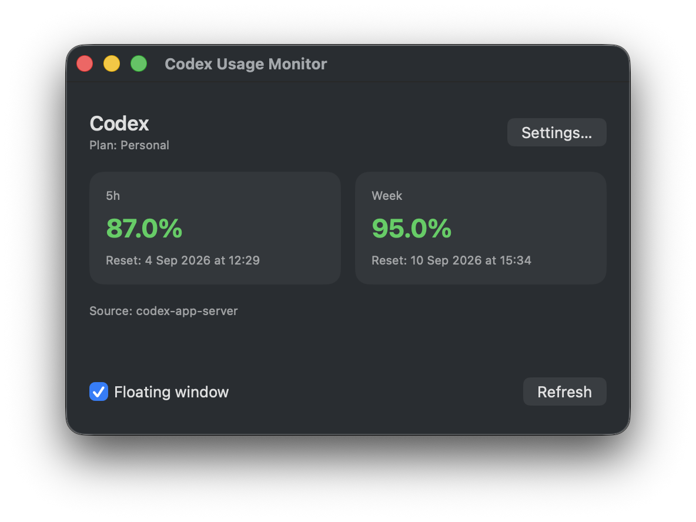
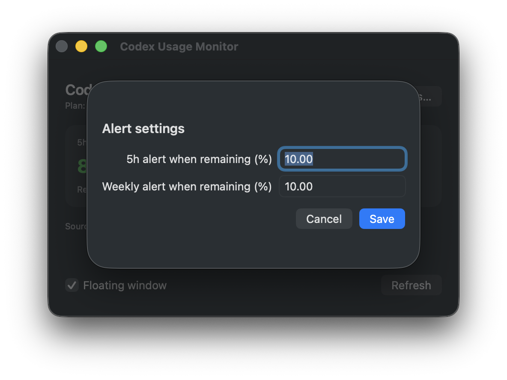
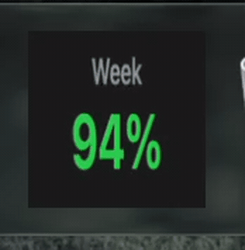

# Codex Usage Monitor

A local macOS utility that displays Codex personal-plan quotas: the rolling **5h** window and the **weekly** quota. It reads quota data from `codex app-server` without sending prompts or content to third parties.

## Features

- Remaining 5h and weekly quotas, including their reset times.
- Independent alerts for each quota.
- Compact view/menu-bar item that alternates between **5h** and **Week** every four seconds.
- Configure both alert thresholds from the app.
- Data and configuration are stored locally only.

## Demo

### Check your quotas
<p align="center">
  
</p>

### Configure your alerts
<p align="center">
  
</p>

### Keep it within eyeshot in the Dock
<p align="center">
  
</p>

## Requirements

- macOS 13 or later.
- Node.js 22 or later.
- An authenticated Codex CLI.
- Swift command-line tools or Xcode.

## Quick start

```bash
npm test
npm start
```

To build the macOS app:

```bash
./scripts/build-macos.sh
open build/CodexUsageMonitor.app
```

The first launch creates:

- Configuration: `~/.config/codex-usage-monitor/config.json`
- Database: `~/Library/Application Support/CodexUsageMonitor/usage.sqlite`

The default plan is `personal`. The actual quota always comes from the account authenticated in the CLI.

## Configuration

The **Settings** screen lets you choose when to alert for the 5h and weekly quotas. For advanced controls, edit the configuration while the app is stopped:

```json
{
  "codex": {
    "plan": "personal",
    "five_hour_alert_percent": 10,
    "weekly_alert_percent": 10,
    "rearm_percent": 15,
    "cli_path": "codex",
    "rate_limit_snapshot_path": "",
    "manual_remaining_percent": null
  }
}
```

## Quota sources

The monitor tries, in this order:

1. `codex app-server` through the authenticated CLI.
2. The JSON configured in `rate_limit_snapshot_path`.
3. Recent metadata from local Codex transcripts.
4. `manual_remaining_percent` for the 5h window.

## Local API

The core listens only on `127.0.0.1:47931`:

```bash
curl http://127.0.0.1:47931/health
curl http://127.0.0.1:47931/config
curl http://127.0.0.1:47931/snapshot
curl -X POST http://127.0.0.1:47931/refresh
```
